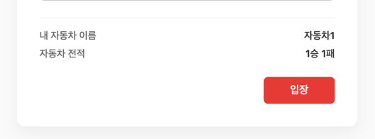
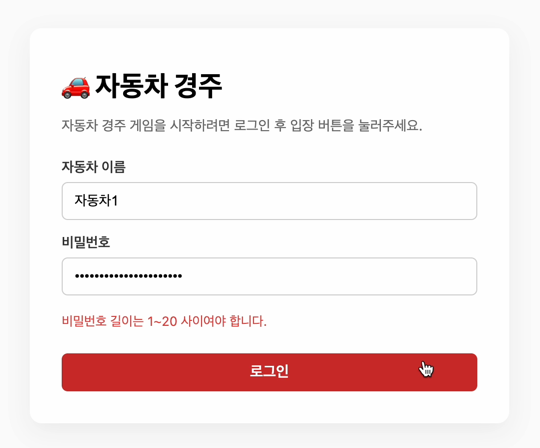
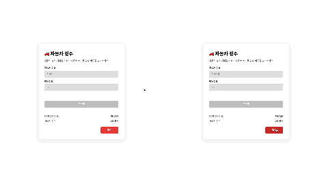
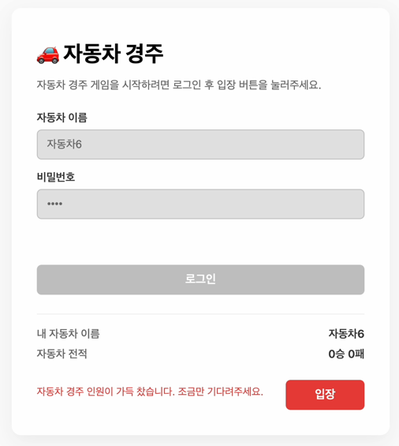
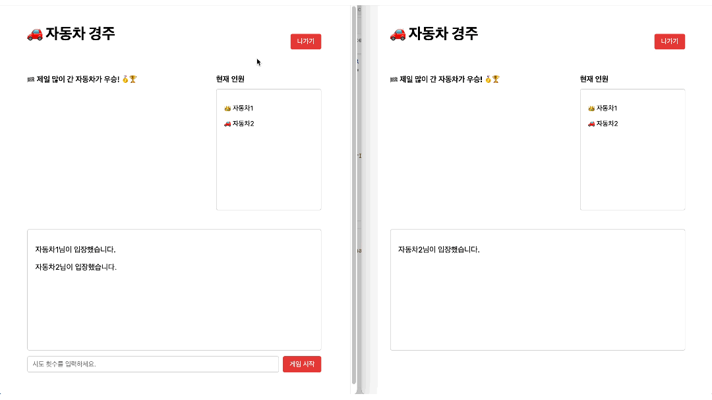
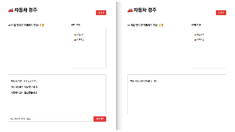
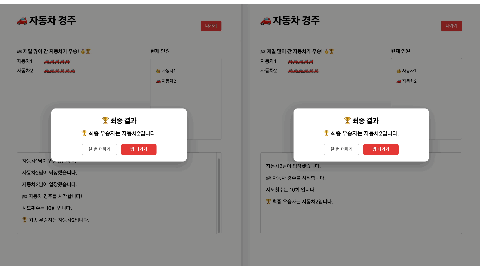
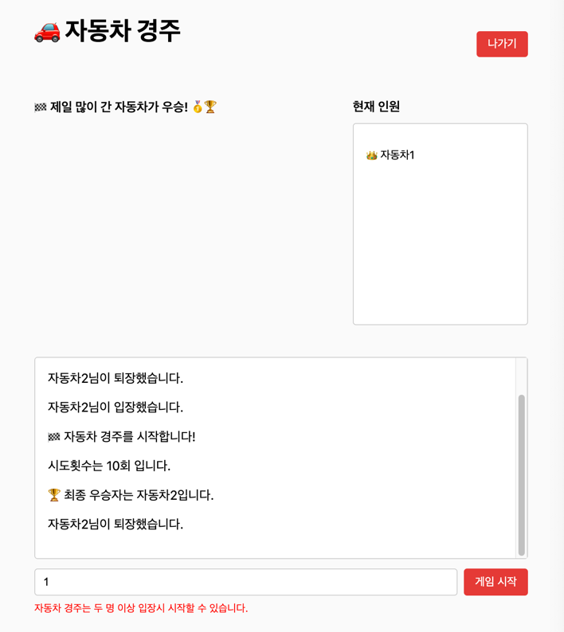
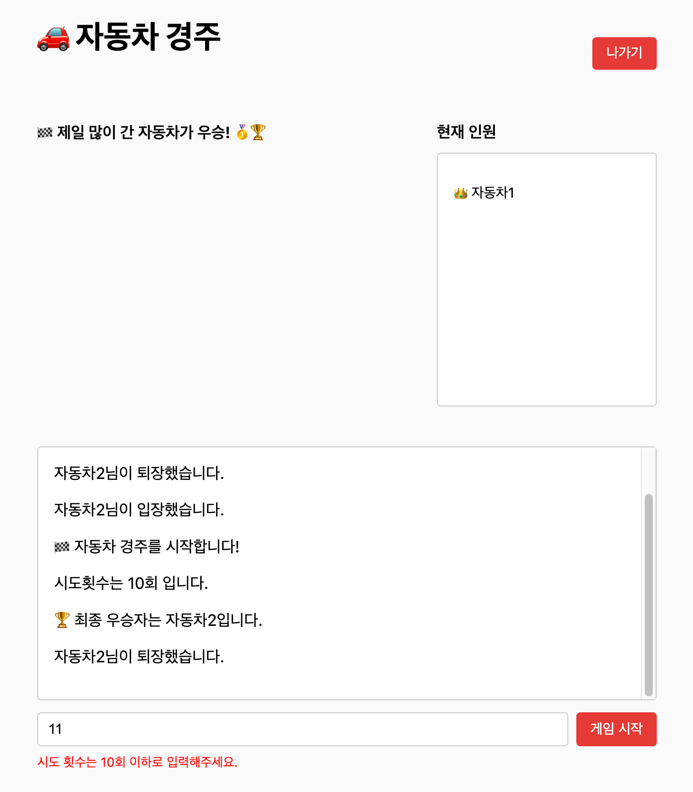
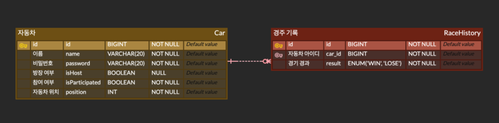

# 오픈 미션 - 실시간 자동차 경주

## 기능 설명 및 시연

### 로그인

- 자동차 이름과 비밀번호를 입력하면 로그인을 합니다.
- 만약 등록이 되지 않은 자동차라면 자동으로 등록됩니다.

- 로그인(자동차 등록)이 성공하게 되면 로그인 창은 입력/선택을 할 수 없는 상태로 변경됩니다.
- 로그인 창 아래 뜨는 정보로 자동차의 승패 전적을 확인할 수 있습니다.

#### 예외 처리

- 자동차 이름과 비밀번호의 최대 길이인 20자를 초과하여 입력하면 예외가 발생합니다.

  |  |  |
  |---------------------------------------------------|---------------------------------------------------|

### 입장

- 로그인 후 입장 버튼을 누르면 자동차 경주 게임 방으로 이동하게 됩니다.
- 만약 경주에 아무도 참여하지 않고 있다면 처음 입장한 자동차가 방장이 됩니다.

- 만약 최대 인원인 5명이 모두 입장한 상태라면 입장할 수 없습니다.

### 나가기

- 나가기 버튼을 누르면 즉시 연결이 종료된 후 메인 화면으로 이동합니다.
- 방장이 나가게 된다면 방장을 위임한 후 나가게 됩니다.

### 경주 시작

- 방장이 시도 횟수를 입력 후 게임 시작 버튼을 누르면, 게임을 시작합니다.
- 게임 결과는 1초 간격으로 업데이트 됩니다.

- 최종 결과는 팝업으로 표시되며, 한 번 더하기와 나가기 중 선택할 수 있습니다.
- 한 번 더하기 선택 시 방장은 4초 뒤 다시 게임을 시작할 수 있습니다.

#### 예외 처리

- 인원이 2명 미만인 경우 게임을 시작하면 예외가 발생합니다.
- 시도 횟수가 10을 초과한 경우 예외가 발생합니다.

|  |  |
|---------------------------------------------------|---------------------------------------------------|

---

## Swagger 접속

- /swagger-ui

## ERD

